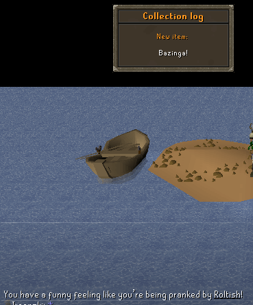
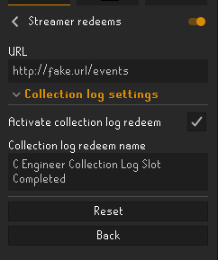

# Streamer redeems

This plugin will allow you to connect to a web service which emits redeems done in a stream and react to those redeems.

Currently only supporting a fake collection log popup. Chatters in a stream can redeem a "collection log" reward and prank the streamer with a fake collection log popup.
A chat message will also be added stating the streamer was pranked, and by whom.



## Configuration

First of all, you need an endpoint to listen for redeems. Create your own with the example below under [Web service](#web-service).

No redeem reactions is activated by default. To activate, you need to provide a name for the redeem and specifically activate it.



## Web service

The web service is not hosted publicly. To create your own, you need a web application which has a server-sent event endpoint with the following data output:

```text
data: {"redeem": "name of the redeem", "message": "optional text in the redeem. For collection log redeem, this will be the item", "redeemedBy": "optional who redeemed the reward"}
```
